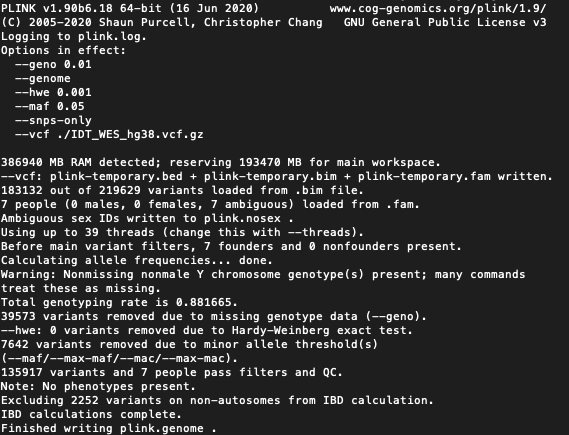

# Run Kinship Analysis on Whole Exome Sequencing Data

Modified from: https://github.com/jinlab-washu/Jin-lab.manual/tree/master/quality_control_analyses

## Plink Identity by Descent

### Run plink command for kinship

Move to a location where you want to store the plink kinship: `cd $your_path_here`

```plink --vcf ./IDT_WES_hg38.vcf.gz --geno 0.01 --hwe 0.001 --maf 0.05 --genome --snps-only```


    
## VCFtools Relatedness

### 1. Load VCFTools

#### Other Cluster:

Load Docker Image biocontainers/vcftools:v0.1.16-1-deb_cv1

```bsub -Is -q research-hpc -R "select[mem>15000] rusage[mem=15000]" -a 'docker(biocontainers/vcftools:v0.1.16-1-deb_cv1@sha256:caa02f1a00f18e1509ff3097cabaebb37b3ab884082ca983b3d7b7b7d13c6744)' /bin/bash```

#### Yale Ruddle:

Load VCFtools with module: `module load VCFTools`

### 2. Run relatedness2

Move to a location where you want to store the plink relatedness results: `cd $your_path_here`

```vcftools --gzvcf $vcf.gz --relatedness2```
    
### Output:

- out.relatedness2
- out.log

## Running Plink for gender check

### 1. Run the following commands:

Move to a location where you want to store the plink gender results: `cd $your_path_here`

`plink --vcf your_path/exome_calls.vcf.gz --out exome_calls_data`

Next command is build specific
    
    For GRCH37:

    plink --bfile exome_calls_data --split-x hg19 --make-bed --out exome_calls_data_split

    For GRCh38: 
    
    plink --bfile exome_calls_data --split-x hg38 --make-bed --out exome_calls_data_split
    
Finally, run: 

`plink --bfile exome_calls_data_split --impute-sex ycount --make-bed --out exome_calls_out`


You should have an output file called `exome_calls_out.sexcheck` in your current directory that contains the gender calls.
